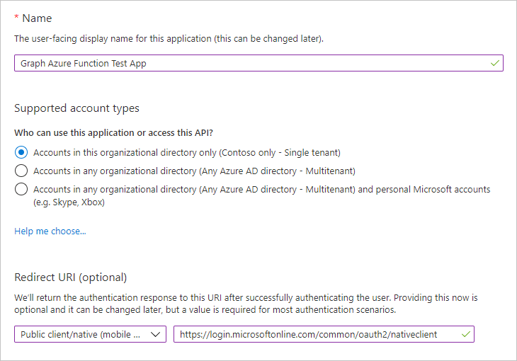
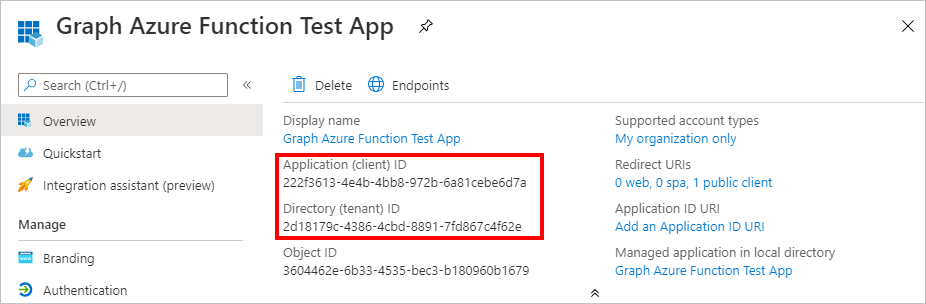
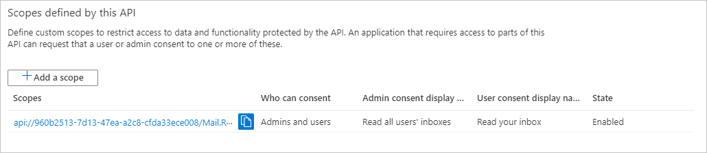
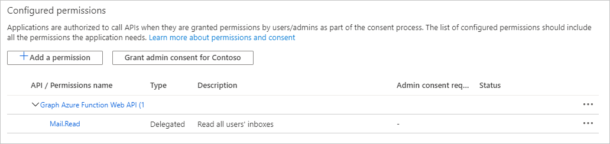

<!-- markdownlint-disable MD002 MD041 -->

In dieser Übung erstellen Sie drei neue Azure AD-Anwendungen mithilfe des Azure Active Directory Admin Center:In this exercise you will create three new Azure AD applications using the Azure Active Directory admin center:

- Eine APP-Registrierung für die einseitige Anwendung, sodass Sie Benutzer anmelden und Token erhalten kann, die es der Anwendung ermöglichen, die Azure-Funktion aufzurufen.An app registration for the single-page application so that it can sign in users and get tokens allowing the application to call the Azure Function.
- Eine APP-Registrierung für die Azure-Funktion, mit der Sie den [im-Auftrag-von-Fluss](https://docs.microsoft.com/azure/active-directory/develop/v2-oauth2-on-behalf-of-flow) zum Austauschen des vom Spa gesendeten Tokens für ein Token verwenden können, mit dem Microsoft Graph aufgerufen werden kann.An app registration for the Azure Function that allows it to use the [on-behalf-of flow](https://docs.microsoft.com/azure/active-directory/develop/v2-oauth2-on-behalf-of-flow) to exchange the token sent by the SPA for a token that will allow it to call Microsoft Graph.
- Eine APP-Registrierung für die Azure-Funktion webhook, die es ermöglicht, den [Client-Anmelde Informationsfluss](https://docs.microsoft.com/azure/active-directory/develop/v2-oauth2-client-creds-grant-flow) zu verwenden, um Microsoft Graph ohne Benutzer aufzurufen.An app registration for the Azure Function webhook that allows it to use the [client credential flow](https://docs.microsoft.com/azure/active-directory/develop/v2-oauth2-client-creds-grant-flow) to call Microsoft Graph without a user.

> [!NOTE]
> In diesem Beispiel sind drei App-Registrierungen erforderlich, da Sie sowohl den Fluss "im Auftrag von" als auch den Client-Anmeldeinformationen implementieren.This example requires three app registrations because it is implementing both the on-behalf-of flow and the client credential flow. Wenn Ihre Azure-Funktion nur einen dieser Datenflüsse verwendet, müssen Sie nur die APP-Registrierungen erstellen, die diesem Fluss entsprechen.If your Azure Function only uses one of these flows, you would only need to create the app registrations that correspond to that flow.

1. Öffnen Sie einen Browser, und navigieren Sie zum [Azure Active Directory Admin Center](https://aad.portal.azure.com) , und melden Sie sich mit einem Administrator der Microsoft 365-mandantenorganisation an.Open a browser and navigate to the [Azure Active Directory admin center](https://aad.portal.azure.com) and login using an Microsoft 365 tenant organization admin.

1. Wählen Sie in der linken Navigationsleiste **Azure Active Directory** aus, und wählen Sie dann **App-Registrierungen** unter **Verwalten** aus.Select **Azure Active Directory** in the left-hand navigation, then select **App registrations** under **Manage**.

    

## Registrieren einer APP für die Anwendung mit einer einzelnen SeiteRegister an app for the single-page application

1. Wählen Sie **Neue Registrierung** aus.Select **New registration**. Legen Sie auf der Seite **Anwendung registrieren** die Werte wie folgt fest.On the **Register an application** page, set the values as follows.

    - Legen Sie **Name** auf `Graph Azure Function Test App` fest.Set **Name** to `Graph Azure Function Test App`.
    - Legen Sie die **unterstützten Kontotypen** **nur in diesem Organisations Verzeichnis auf Konten** fest.Set **Supported account types** to **Accounts in this organizational directory only**.
    - Ändern Sie unter **Umleitungs-URI** das Dropdown in **Single-Page Application (Spa)** , und legen Sie den Wert auf fest `http://localhost:8080` .Under **Redirect URI** , change the dropdown to **Single-page application (SPA)** and set the value to `http://localhost:8080`.

    

1. Wählen Sie **Registrieren** aus.Select **Register**. Kopieren Sie auf der Seite **Graph Azure Function Test App** die Werte der Anwendungs-ID **(Client) ID** und **Verzeichnis (Mandanten)** , und speichern Sie Sie, dann benötigen Sie Sie in den späteren Schritten.On the **Graph Azure Function Test App** page, copy the values of the **Application (client) ID** and **Directory (tenant) ID** and save them, you will need them in the later steps.

    

## Registrieren einer APP für die Azure-FunktionRegister an app for the Azure Function

1. Kehren Sie zu **App-Registrierungen** zurück, und wählen Sie **neue Registrierung** aus.Return to **App Registrations** , and select **New registration**. Legen Sie auf der Seite **Anwendung registrieren** die Werte wie folgt fest.On the **Register an application** page, set the values as follows.

    - Legen Sie **Name** auf `Graph Azure Function` fest.Set **Name** to `Graph Azure Function`.
    - Legen Sie die **unterstützten Kontotypen** **nur in diesem Organisations Verzeichnis auf Konten** fest.Set **Supported account types** to **Accounts in this organizational directory only**.
    - Lassen Sie die **Umleitungs-URI** leer.Leave **Redirect URI** blank.

1. Wählen Sie **Registrieren** aus.Select **Register**. Kopieren Sie auf der Seite **Diagramm Azure-Funktion** den Wert der **Anwendungs-ID (Client)** , und speichern Sie Sie, um Sie im nächsten Schritt zu benötigen.On the **Graph Azure Function** page, copy the value of the **Application (client) ID** and save it, you will need it in the next step.

1. Wählen Sie unter **Verwalten** die Option **Zertifikate und Geheime Clientschlüssel** aus.Select **Certificates & secrets** under **Manage**. Wählen Sie die Schaltfläche **Neuen geheimen Clientschlüssel** aus.Select the **New client secret** button. Geben Sie einen Wert in **Beschreibung** ein, wählen Sie eine der Optionen für **Gilt bis** aus, und wählen Sie dann **Hinzufügen** aus.Enter a value in **Description** and select one of the options for **Expires** and select **Add**.

    

1. Kopieren Sie den Wert des geheimen Clientschlüssels, bevor Sie diese Seite verlassen.Copy the client secret value before you leave this page. Sie benötigen ihn im nächsten Schritt.You will need it in the next step.

    > [!IMPORTANT]
    > Dieser geheime Clientschlüssel wird nicht noch einmal angezeigt, stellen Sie daher sicher, dass Sie ihn jetzt kopieren.This client secret is never shown again, so make sure you copy it now.

    

1. Wählen Sie unter **Manage** die **API-Berechtigungen** aus.Select **API Permissions** under **Manage**. Wählen Sie **Berechtigung hinzufügen** aus.Choose **Add a permission**.

1. Wählen Sie **Microsoft Graph** und dann **Delegierte Berechtigungen** aus.Select **Microsoft Graph** , then **Delegated Permissions**. Fügen Sie **Mail. Read** hinzu, und wählen Sie **Berechtigungen hinzufügen** aus.Add **Mail.Read** and select **Add permissions**.

    

1. Wählen Sie unter **Manage** **eine API verfügbar machen** aus, und wählen Sie dann **Bereich hinzufügen** aus.Select **Expose an API** under **Manage** , then choose **Add a scope**.

1. Akzeptieren Sie den Standard **-URI der Anwendungs-ID** , und wählen Sie **Speichern und Fortfahren**.Accept the default **Application ID URI** and choose **Save and continue**.

1. Füllen Sie das Formular zum **Hinzufügen eines Bereichs** wie folgt aus:Fill in the **Add a scope** form as follows:

    - **Bereichsname:** Mail. Read**Scope name:** Mail.Read
    - **Wer kann zustimmen?:** Administratoren und Benutzer**Who can consent?:** Admins and users
    - **Anzeigename der Administrator Zustimmung:** Alle Posteingänge aller Benutzer lesen**Admin consent display name:** Read all users' inboxes
    - **Beschreibung der Administrator Zustimmung:** Ermöglicht der APP, alle Posteingänge aller Benutzer zu lesen.**Admin consent description:** Allows the app to read all users' inboxes
    - **Anzeigename der Benutzer Zustimmung:** Lesen Ihres Posteingangs**User consent display name:** Read your inbox
    - **Beschreibung der Benutzer Zustimmung:** Ermöglicht der APP, Ihren Posteingang zu lesen**User consent description:** Allows the app to read your inbox
    - **Status:** Aktiviert**State:** Enabled

1. Klicken Sie auf **Bereich hinzufügen**.Select **Add scope**.

1. Kopieren Sie den neuen Bereich, Sie benötigen ihn in späteren Schritten.Copy the new scope, you'll need it in later steps.

    

1. Wählen Sie unter **Manage** die Option **Manifest** aus.Select **Manifest** under **Manage**.

1. Suchen `knownClientApplications` Sie im Manifest, und ersetzen Sie den aktuellen Wert von `[]` mit `[TEST_APP_ID]` , wobei `TEST_APP_ID` die Anwendungs-ID der APP-App-Registrierung der **Graph-Azure-Funktions Test** ist.Locate `knownClientApplications` in the manifest, and replace it's current value of `[]` with `[TEST_APP_ID]`, where `TEST_APP_ID` is the application ID of the **Graph Azure Function Test App** app registration. Wählen Sie **Speichern** aus.Select **Save**.

> [!NOTE]
> Durch Hinzufügen der APP-ID der Testanwendung zur `knownClientApplications` Eigenschaft im Manifest der Azure-Funktion kann die Testanwendung einen [kombinierten Zustimmungs Fluss](https://docs.microsoft.com/azure/active-directory/develop/v2-oauth2-on-behalf-of-flow#default-and-combined-consent)auslösen.Adding the test application's app ID to the `knownClientApplications` property in the Azure Function's manifest allows the test application to trigger a [combined consent flow](https://docs.microsoft.com/azure/active-directory/develop/v2-oauth2-on-behalf-of-flow#default-and-combined-consent). Dies ist erforderlich, damit der "im Auftrag von"-Fluss funktioniert.This is necessary for the on-behalf-of flow to work.

## Hinzufügen eines Azure-Funktionsbereichs zum Testen der AnwendungsregistrierungAdd Azure Function scope to test application registration

1. Kehren Sie zur APP-Registrierung von **Graph Azure Function Test** zurück, und wählen Sie unter **Manage** die Option **API-Berechtigungen** aus.Return to the **Graph Azure Function Test App** registration, and select **API Permissions** under **Manage**. Wählen Sie **Berechtigung hinzufügen** aus.Select **Add a permission**.

1. Wählen Sie **meine APIs** aus, und wählen Sie dann **mehr laden** aus.Select **My APIs** , then select **Load more**. Wählen Sie **Graph Azure Function** aus.Select **Graph Azure Function**.

    

1. Wählen Sie die Berechtigung **Mail. Read** aus, und wählen Sie **Berechtigungen hinzufügen** aus.Select the **Mail.Read** permission, then select **Add permissions**.

1. Entfernen Sie in den **konfigurierten Berechtigungen** die Berechtigung **User. Read** unter **Microsoft Graph** , indem Sie rechts neben der Berechtigung die **...** auswählen und die Berechtigung **Entfernen** auswählen.In the **Configured permissions** , remove the **User.Read** permission under **Microsoft Graph** by selecting the **...** to the right of the permission and selecting **Remove permission**. Wählen Sie **Ja, entfernen** zur Bestätigung aus.Select **Yes, remove** to confirm.

    

## Registrieren einer APP für die Azure-Funktion webhookRegister an app for the Azure Function webhook

1. Kehren Sie zu **App-Registrierungen** zurück, und wählen Sie **neue Registrierung** aus.Return to **App Registrations** , and select **New registration**. Legen Sie auf der Seite **Anwendung registrieren** die Werte wie folgt fest.On the **Register an application** page, set the values as follows.

    - Legen Sie **Name** auf `Graph Azure Function Webhook` fest.Set **Name** to `Graph Azure Function Webhook`.
    - Legen Sie die **unterstützten Kontotypen** **nur in diesem Organisations Verzeichnis auf Konten** fest.Set **Supported account types** to **Accounts in this organizational directory only**.
    - Lassen Sie die **Umleitungs-URI** leer.Leave **Redirect URI** blank.

1. Wählen Sie **Registrieren** aus.Select **Register**. Kopieren Sie auf der Seite **Graph Azure Function webhook** den Wert der **Anwendungs-ID (Client)** , und speichern Sie Sie, um Sie im nächsten Schritt zu benötigen.On the **Graph Azure Function webhook** page, copy the value of the **Application (client) ID** and save it, you will need it in the next step.

1. Wählen Sie unter **Verwalten** die Option **Zertifikate und Geheime Clientschlüssel** aus.Select **Certificates & secrets** under **Manage**. Wählen Sie die Schaltfläche **Neuen geheimen Clientschlüssel** aus.Select the **New client secret** button. Geben Sie einen Wert in **Beschreibung** ein, wählen Sie eine der Optionen für **Gilt bis** aus, und wählen Sie dann **Hinzufügen** aus.Enter a value in **Description** and select one of the options for **Expires** and select **Add**.

1. Kopieren Sie den Wert des geheimen Clientschlüssels, bevor Sie diese Seite verlassen.Copy the client secret value before you leave this page. Sie benötigen ihn im nächsten Schritt.You will need it in the next step.

1. Wählen Sie unter **Manage** die **API-Berechtigungen** aus.Select **API Permissions** under **Manage**. Wählen Sie **Berechtigung hinzufügen** aus.Choose **Add a permission**.

1. Wählen Sie **Microsoft Graph** und dann **Anwendungsberechtigungen** aus.Select **Microsoft Graph** , then **Application Permissions**. Fügen Sie **User. Read. all** und **Mail. Read** hinzu, und wählen Sie dann **Berechtigungen hinzufügen** aus.Add **User.Read.All** and **Mail.Read** , then select **Add permissions**.

1. Entfernen Sie in den **konfigurierten Berechtigungen** die Berechtigung Delegierter **Benutzer. Read** unter **Microsoft Graph** , indem Sie rechts neben der Berechtigung die **...** auswählen und die Berechtigung **Entfernen** auswählen.In the **Configured permissions** , remove the delegated **User.Read** permission under **Microsoft Graph** by selecting the **...** to the right of the permission and selecting **Remove permission**. Wählen Sie **Ja, entfernen** zur Bestätigung aus.Select **Yes, remove** to confirm.

1. Wählen Sie die Schaltfläche **Administrator Zustimmung erteilen für...** , und klicken Sie dann auf **Ja** , um der Administrator Zustimmung für die konfigurierten Anwendungsberechtigungen zu erteilen.Select the **Grant admin consent for...** button, then select **Yes** to grant admin consent for the configured application permissions. Die Spalte **Status** in der **konfigurierten Berechtigungs** Tabelle ändert sich in **gewährt für...**.The **Status** column in the **Configured permissions** table changes to **Granted for ...**.

    
